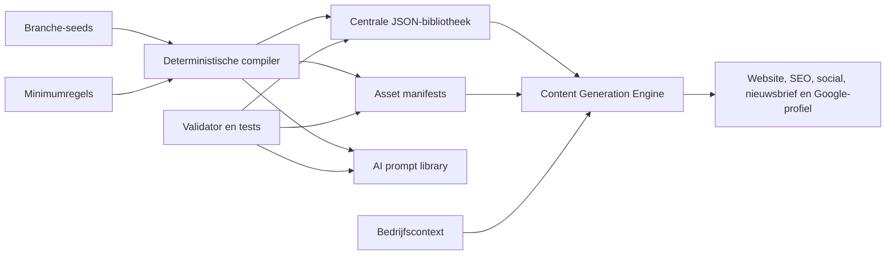

# Content Factory architectuur

## Doel

De Content Factory is een zelfstandig, deterministisch datapakket naast de productiecode. De Website Factory kan een branche kiezen, bedrijfscontext invullen en binnen één run een volledig contentpakket ontvangen. De bibliotheek bevat geen gegenereerde klantclaims en publiceert voorbeeldreviews nooit als echte reviews.

## Lagen

1. **Bronlaag** — `src/verticals.mjs` bevat compacte, handmatig onderhoudbare branche-seeds en gedeelde categorieprofielen.
2. **Compileerlaag** — `src/compiler.mjs` verrijkt ieder seed tot dezelfde volledige content-, merk-, asset- en promptstructuur.
3. **Bibliotheeklaag** — `generated/` bevat centrale en per-branche JSON. `content-library/` reserveert uniforme assetlocaties.
4. **Runtime-laag** — `src/engine.mjs` selecteert deterministisch content, vervangt bedrijfsplaceholders en levert kanaalbestanden op.
5. **Governancelaag** — `schemas/`, `config/requirements.json`, `src/validator.mjs` en tests bewaken contracten en minimumaantallen.

## Versiebeheer

- `schema_version` verandert bij contractwijzigingen.
- `content_version` verandert bij inhoudelijke releases.
- Gegenereerde data wordt gecommit zodat wijzigingen reviewbaar en reproduceerbaar zijn.
- `generated_at` is bewust stabiel (`deterministic-build`) om ruis in diffs te voorkomen.
- Runtime-output bevat wel een echte generatietijd, maar wordt standaard niet gecommit.

## Integratiegrens

Deze eerste versie wijzigt niets onder `functions/`, `public/` of andere productiegebieden. Een toekomstige adapter mag `generateContentPackage()` vanuit de Website Factory aanroepen. De adapter moet branch-slug, bedrijfsnaam en plaats leveren en kan daarna de kanaal-JSON aan bestaande templates koppelen.
